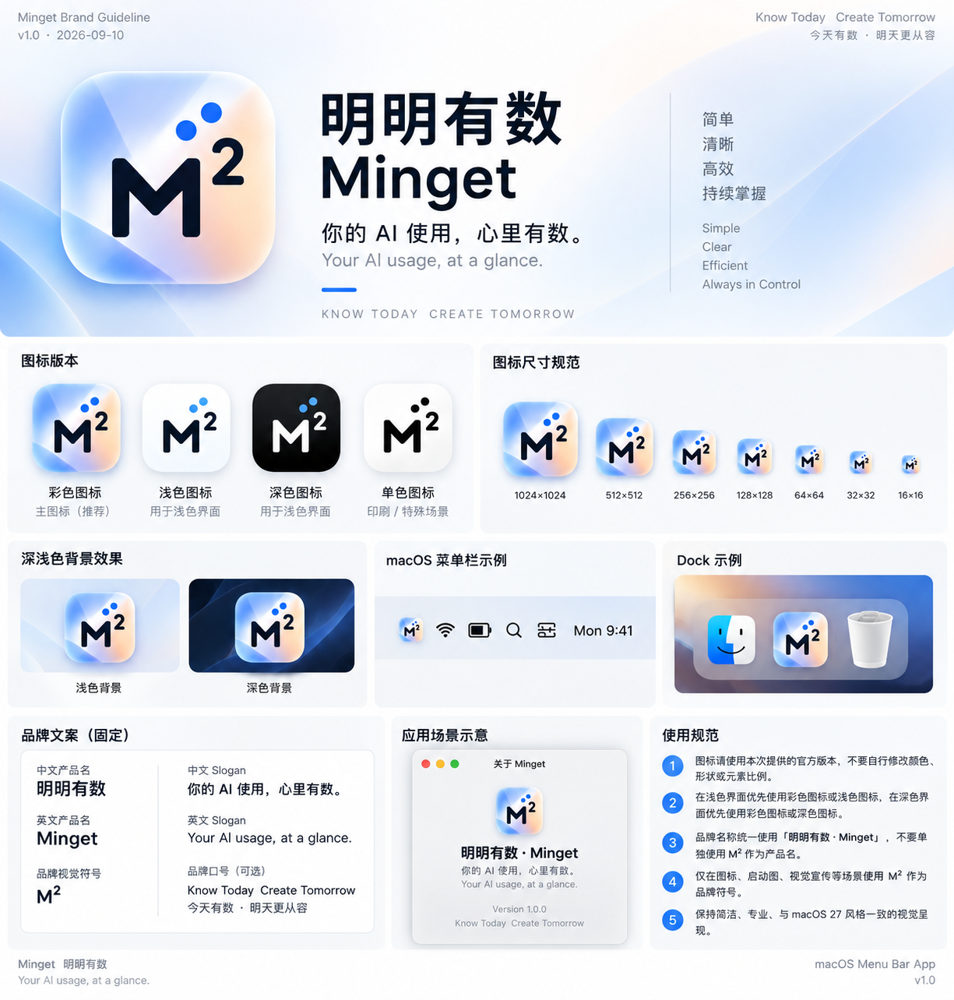

# 明明有数 · Minget 品牌规范

版本：1.0 
日期：2026-09-10

## 正式名称

- 中文产品名：明明有数
- 英文产品名：Minget
- 品牌视觉符号：M²

标准展示形式：**明明有数 · Minget**

`M²` 用于 Logo、App Icon、菜单栏图标和其他视觉识别元素。正式英文产品名称始终使用 `Minget`。在不适合使用 Unicode 上标字符的工程场景中，也使用 `Minget`。

## 固定文案

中文 Slogan：

> **你的 AI 使用，心里有数。**

英文 Slogan：

> *Your AI usage, at a glance.*

以上两句话为正式品牌文案，不自行改写。

## 产品定位

统一查看和管理个人 AI 服务使用状态、可用资源与成本信息的 macOS 菜单栏工具。

当前版本以 Codex 额度、DeepSeek 余额和智谱 GLM 余额为主要能力。未来可以扩展更多 AI Provider、Token、Credits、使用趋势、预算、成本和预测能力。

## 名称含义

“明明有数”表达 AI 使用状态清晰可见，也包含每日、月度、未来趋势和数据管理的延展含义。“数”同时对应心里有数、数据、用量和数字。

`Minget` 中的 `Ming` 来自“明”，表示清楚和明白；`Get` 表示获取和掌握，也可联想到 `get it`。

`M²` 的视觉逻辑为 `Ming × Ming = Ming²`，对应“明 × 明 = 明明”，上标数字与中文名称中的“数”形成呼应。

## 工程边界

对外界面、README、发布展示和品牌素材使用 Minget。以下内部技术标识为保证兼容性继续保留 `UsageMonitor`：

- Swift Package 和 Target 名称
- 源码目录和模块名称
- Bundle Identifier
- UserDefaults、缓存和状态项持久化键
- 可执行文件内部名称和诊断标识
- `docs/archive/v1.0` 中已冻结的历史资料

## 品牌资产

- `assets/brand/minget-brand-guideline-v1.0.png`：用户提供的完整品牌规范图。
- `assets/brand/minget-app-icon-1024.png`：1024×1024 应用图标母版。
- `assets/brand/Minget.icns`：macOS 应用包使用的多尺寸图标。
- `assets/usagemonitor-menubar-v1.0.png`：v1.0 菜单栏实测截图，保留原始文件名以记录历史。

---

## English

### Official identity

- Chinese product name: 明明有数
- English product name: Minget
- Visual brand mark: M²
- Chinese slogan: **你的 AI 使用，心里有数。**
- English slogan: *Your AI usage, at a glance.*

The standard bilingual display is **明明有数 · Minget**. `M²` is the visual mark for the logo, app icon, and menu bar. It does not replace `Minget` as the official English product name.

Minget is positioned as a macOS menu bar tool for viewing and managing personal AI service status, available resources, and cost information. Its current scope covers Codex, DeepSeek, and Zhipu GLM. Future versions may add providers, tokens, credits, trends, budgets, costs, and forecasts.

Public-facing UI and documentation use Minget. Internal Swift package names, targets, directories, bundle identifier, persistence keys, executable names, diagnostics, and the frozen `docs/archive/v1.0` history retain the `UsageMonitor` engineering identifier for compatibility and historical accuracy.
