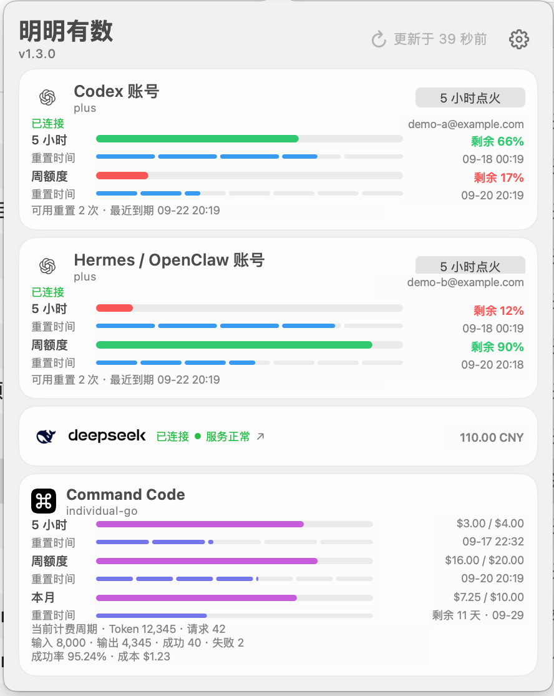
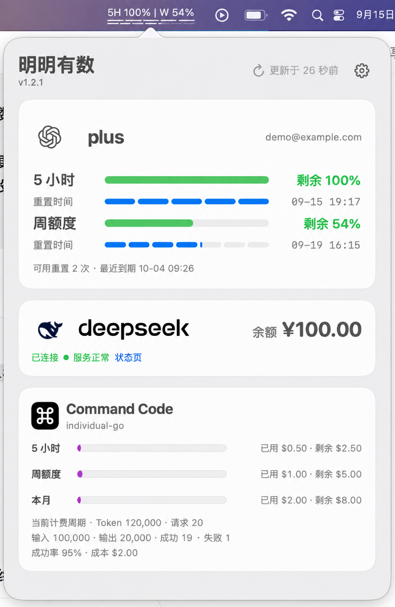
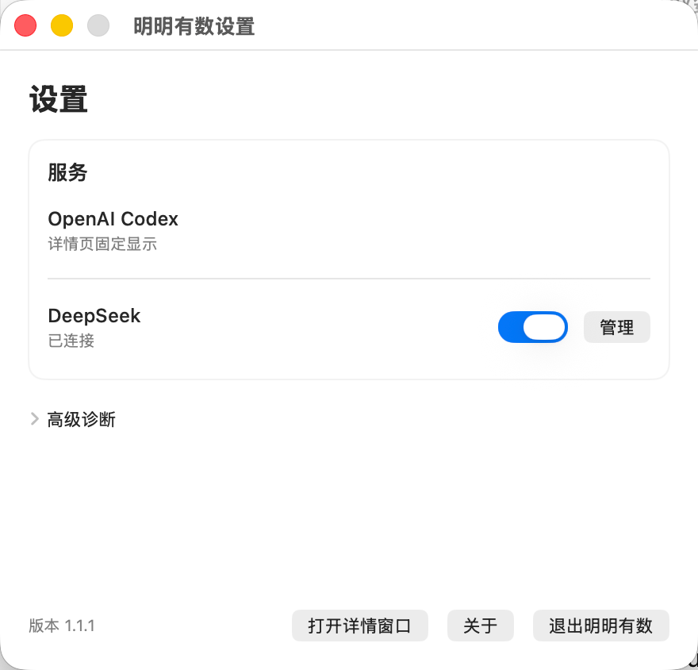

# 明明有数 · Minget

[](https://github.com/ym911x/Minget/actions/workflows/ci.yml)


**你的 AI 使用，心里有数。**<br>
*Your AI usage, at a glance.*

Minget 是一个 macOS 菜单栏应用，用于集中查看两个隔离的 ChatGPT (Codex) 账号、DeepSeek 与 Command Code 的额度、余额和使用状态。

## v1.4.1 外观优化

- 详情页保持 440 pt 单列，放大标题、额度和辅助文字，用 4/10/12 pt 留白分组，移除卡片内细分隔线；短屏只滚动卡片区。
- “明明有数”与版本号同行；ChatGPT 使用自定义名称、套餐和连接绿点两行头部；DeepSeek 增加服务器状态和官方状态页入口。
- 时间条固定为 5 小时 5 格、周额度 7 格，本月使用连续条；Command Code 统计拆为 Token／成本和请求／结果两行，月度文案使用“天数 · 日期”。
- 设置页为两个 ChatGPT 账号、DeepSeek 和 Command Code 提供本地显示名称、保存和恢复默认；名称同步详情页、来源选择、点火计划和辅助标签，菜单栏继续使用 A/B/DS 短标签。

本版本已完成代码实现、完整自动测试、Release arm64 构建、严格签名和真实界面验收；用户已确认按可见图案边界修订后的 OpenAI 与 DeepSeek Logo。发布提交 CI 通过，源码已随 [Minget v1.4.1](https://github.com/ym911x/Minget/releases/tag/v1.4.1) 发布。详见 [1.4.1 需求](docs/versions/1.4.1/REQUIREMENTS.md)、[实施任务](docs/versions/1.4.1/IMPLEMENTATION_TASKS.md) 与[验收台账](docs/versions/1.4.1/ACCEPTANCE.md)。

## v1.4.0 更新

- 应用内 Command Code 手动点火与定时点火统一使用 `deepseek/deepseek-v4.1-flash`；外部 `minget-fire` 已核对为同一模型，LaunchAgent 时间表本版本不改。
- 菜单栏当前选中的 ChatGPT 账号在 5 小时剩余低于阈值或周额度低于阈值时，增加只针对该账号的补充刷新；当前显示 DeepSeek 且 CNY 余额低于阈值时同样增加补充刷新。
- 设置页可调整低额度加速开关、15/30/60 秒周期、5 小时阈值、周阈值和 DeepSeek CNY 金额阈值；默认值为启用、30 秒、50%、15%、15.00 元。
- 当前来源切换、阈值严格小于边界、无效输入 fail-closed 和补充 timer 停止均有回归测试。

本版本已通过发布验收：513 项自动测试执行，512 通过、1 项既有 AX 环境跳过、0 失败；Release arm64 构建、staging/install/archive 严格签名、签名包退出/重启和设置页明暗布局检查通过。发布提交 CI 通过，源码已随 [Minget v1.4.0](https://github.com/ym911x/Minget/releases/tag/v1.4.0) 发布。真实低额度服务轮询未通过人为制造额度条件触发，保留为发布后现场观察项。详见 [1.4.0 需求](docs/versions/1.4.0/REQUIREMENTS.md)与[验收台账](docs/versions/1.4.0/ACCEPTANCE.md)。

## v1.3.2 修订

- 点火确认只读取额度（`handshake + rateLimits/read`），不再附带账号身份请求；失败熔断语义不变。
- 点火结果追加实测差值：`新窗口已确认 · +6小时12分`，未变化如 `请求成功，窗口未变化 · +32秒`，暂无法确认不追加；辅助功能值同步。
- 每个账号内存保留最近 3 次点火，悬停结果查看 `MM-dd HH:mm 结果 · 差值` 多行；重启即清空，不持久化。
- 详情页时钟从每秒降为每 30 秒；菜单栏倒计时仍按需计算，不受影响。
- ChatGPT 定时按重置时间退避：临近 10 分钟内 30 秒，无数据 60 秒，否则 120 秒。
- Command Code 统计与订阅 15 分钟复用，额度仍 5 分钟；手动刷新强制全量。
- 菜单栏宽度按尺寸签名缓存；睡眠唤醒后一次节流刷新。
- 设置页新增每日 5 小时点火计划：OpenAI 账号 A、账号 B 和 Command Code 各自可添加多个时间，每条勾选后生效，错过最多补跑 10 分钟。
- Command Code 详情卡新增「5 小时点火」：用户确认或启用计划后，Minget 把 Keychain 中的 Key 仅传给隔离环境中的官方 CLI，执行一次最小请求，丢弃输出，再仅读 `credits` 确认窗口。
- R2 测试维护修复：辅助功能测试循环内重取窗口，注释按实测对齐。

本版本是小版本优化版。菜单栏格式、额度语义和点火三态真值表不变；Command Code 卡片与设置页因新控件增高。

## v1.3.1 修订

- 两个 ChatGPT 账号的刷新仍同时启动，但任一账号一返回就立即发布自己的新状态，不再等待另一个账号。卡片顺序仍固定为账号 A、账号 B；整轮刷新状态仍在最后一个账号完成后才结束。
- 点火结果由两种细分为三种：`新窗口已确认`、`请求成功，窗口未变化`，以及证据不足时的`请求成功，暂无法确认`。只有点火前后都取得实时重置时间且前移 ≥ 60 秒才确认新窗口；缓存结果不再被当作“窗口未变化”。
- 第一次确认刷新已是实时前移时立即结束；其他情况（含第一次实时时间尚未变化）会再等 5 秒做一次只读刷新。第二次刷新只读取额度，不重复模型请求。
- Command Code 以 `credits` 为必须的主数据，`summary` 与 `subscriptions` 为可选辅助数据：辅助接口失败时，已取得的额度仍为实时，统计区显示`统计暂不可用 · Token — · 请求 —`，不推算总额或周期。
- Command Code 显示缓存数据时给出明确文字：套餐名后追加`· 缓存`，帮助文本给出最后成功时间；无套餐名时显示`缓存数据`。
- 修复 Command Code 卡片的辅助功能回归：卡片标题行不再整体合并，只合并 Logo、标题和状态文字，无数据时的「前往设置／查看设置」按钮保留为独立辅助功能按钮和 press 动作。

本版本是稳定性修补版。窗口尺寸、卡片顺序、额度语义、菜单栏格式和凭证安全边界与 1.3.0 相同。

## v1.3.0 修订

- 详情页同时显示两个 ChatGPT 账号卡片，各自绑定一个独立的 `CODEX_HOME` 与独立的 `codex app-server` 子进程，额度、套餐、账号和缓存互不串号。
- 设置页新增“菜单栏显示”单选项，可在账号 A、账号 B 与 DeepSeek 之间切换；菜单栏一次只显示一个来源，ChatGPT 文案带账号短标签（`A 5H 78% | W 42%`），DeepSeek 显示官方余额接口返回的余额（`DS CNY 123.45`）且不显示重置时间条。
- 每张 ChatGPT 卡片提供独立的“5 小时点火”按钮：确认后应用直接执行官方 Codex CLI 的固定参数，用该账号的隔离目录作为 `CODEX_HOME`，只保留请求结果，不写 raw log、不调用 `minget-fire`。
- 详情页为 `440 pt` 宽的单列固定布局，一排一张卡片，顺序为 ChatGPT A、ChatGPT B、DeepSeek、Command Code；四张卡片全部显示时固定 `440 × 552 pt`，一页看完。设置页固定 `520 × 600 pt`。两者都不使用任何滚动容器。
- 应用改为显式 AppKit 启动，不再声明任何 SwiftUI `Scene`，冷启动只出现菜单栏图标，不再出现空的「设置」窗口。
- Minget 自身仍不打开、解析、复制或上传任何 Codex 配置或认证文件；它只把用户配置的隔离目录作为环境变量传给官方 CLI 子进程。



*1.3.0 详情页脱敏展示副本。邮箱、余额、额度、重置时间和用量均已替换为示例数据；界面布局来自用户确认的真实运行截图。*

自动测试 425 项通过（Core 325、App 100），Release 构建、严格签名与真实详情页验收通过。源码随 [Minget v1.3.0](https://github.com/ym911x/Minget/releases/tag/v1.3.0) 发布；真实 DeepSeek 菜单栏余额与 A/B 两次真实点火仍未执行，结果记录在 [1.3.0 验收台账](docs/versions/1.3.0/ACCEPTANCE.md)。

## v1.2.1 修订

- Command Code 卡片内的已用、剩余和成本金额统一显示到小数点后 2 位，底层 `Decimal` 数据不变。
- 移除 Command Code 卡片底部的单独更新时间；详情页顶部继续提供全局刷新状态。



*1.2.1 详情页脱敏展示副本。邮箱、余额和用量均已替换为示例数据，菜单栏已移除其他第三方程序图标。*

## v1.2.0 修订

- 详情页新增可隐藏的 Command Code 用量卡片。用户在应用内填写的 API Key 仅保存于 macOS Keychain，菜单栏仍只显示 Codex 的双额度。
- 卡片可展示 5 小时、周和月度信用额，以及 token、请求、成功率与成本摘要。字段缺失、接口变更或统计周期未知时明确显示不可用或未确认，不推算数字。
- 请求只允许 `https://api.commandcode.ai` 的三条只读 `/alpha` 用量路径，使用 `Authorization: Bearer` 与 `Accept: application/json`；模型端点、未列路径和跨域重定向均会在本地拒绝。

用户截图已确认真实 Command Code API Key 能返回额度与统计数据。字段与 Studio 的同刻对账仍记为待确认，真实账号、余额、成本和原始响应均未写入仓库。

## v1.1.2 修订

- 菜单栏只在完整和紧凑双额度模式之间切换；空间不足时也保留 `5H`、`W` 和两排重置时间条，无法容纳完整紧凑内容时打开详情窗口。
- OpenAI 详情卡在额度轨道下显示可用 earned rate-limit reset 数量；接口提供有效明细时追加最近到期时间。该信息只读，缓存数据不会冒充当前可用权益。
- DeepSeek 详情卡使用鲸鱼 Logo 与现有 `deepseek` 文字标识，真实余额与品牌同列右侧并垂直居中，连接和官方服务状态位于 Logo 下方。官方余额接口没有账号名称或邮箱字段，因此不生成账号占位信息。
- 详情页为固定整页布局，不显示滚动条；窗口会为启用的 DeepSeek 多币种余额预留完整高度。

1.1.2 真实界面已经验收。本页下方截图暂保留明确标注的 1.1.1 脱敏历史基线，避免把含个人账号和余额的实时画面直接写入仓库；后续如补充 1.1.2 公开截图，继续使用明确标注的脱敏副本。

## v1.1.1 界面（历史基线）


*菜单栏显示 5 小时额度和周额度；下方两排短线表示距离两个窗口重置的时间进度，不代表剩余额度。*


*详情页脱敏展示副本。账号已替换为示例地址，其余内容来自用户提供的 1.1.1 实测界面。*



*设置页实测截图。服务模块集中提供 OpenAI Codex 固定详情状态和 DeepSeek 显示、连接管理入口。*

长期定位：统一查看和管理个人 AI 服务使用状态、可用资源与成本信息的 macOS 菜单栏工具。

## 当前版本

- 当前版本：`1.4.1`
- 状态：1.4.1 外观优化与本地显示名称已完成并发布；517 项自动测试执行，516 通过、1 项 AX 环境跳过、0 失败；Release arm64 构建、严格签名、签名包重启、真实界面验收和发布提交 CI 通过。源码已随 [GitHub Release v1.4.1](https://github.com/ym911x/Minget/releases/tag/v1.4.1) 发布。资料见 [1.4.1 验收台账](docs/versions/1.4.1/ACCEPTANCE.md)。
- 平台：macOS 13 及以上，Apple Silicon
- 发布记录：[CHANGELOG.md](CHANGELOG.md)
- 后续规划：[ROADMAP.md](ROADMAP.md)

## 已实现功能

- 同时监控两个隔离的 ChatGPT (Codex) 账号：各自独立的 `CODEX_HOME`、独立的长生命周期 `codex app-server` 子进程、独立的失败预算与独立的额度缓存。
- 菜单栏一次显示一个来源：ChatGPT 账号 A、ChatGPT 账号 B 或 DeepSeek，可在设置页切换并持久化；升级默认保持账号 A。
- ChatGPT 菜单栏文案带账号短标签与两排重置时间进度：完整 `A 5H 78% | W 42%`，紧凑 `A 78% 42%`，下方上排 5 段代表 5 小时、下排 7 段代表 7 天。
- DeepSeek 菜单栏条目显示官方余额接口返回的余额，不换算、不合计、不显示重置时间条：完整和紧凑模式均为 `DS CNY 123.45`，通过字号与词间距区分宽度；无可用余额时显示 `DS —` 并加一个前置警告标记，不显示 `0`。
- 检测状态项是否进入刘海遮挡区域，并在空间不足时从完整模式压缩为保留双额度与双时间条的紧凑模式；紧凑内容仍无法显示时打开详情窗口，不显示残缺文字。
- 点击菜单栏打开详情后，点击桌面或其他应用可立即收起弹层，同时保留原点击效果。
- 应用以显式 AppKit 入口启动，不声明任何 SwiftUI Scene；冷启动只出现菜单栏图标，不会出现空的设置窗口。弹层在显示前先确定内容尺寸，屏幕容纳不下整页时改用普通详情窗口，不会留下越界且无法移回的弹层。
- 详情页为 440 pt 宽的单列布局，一排一张卡片：ChatGPT A、ChatGPT B、DeepSeek、Command Code；完整首选高度为 `440 × 801 pt`，屏幕高度不足时只滚动卡片区，普通详情窗口同步使用可用 viewport。
- 每张 ChatGPT 卡片显示 Profile 名称、连接/缓存状态、套餐、实际账号邮箱、5 小时与周额度的**剩余额度轨道和各自的重置时间分段轨道**（5 小时 5 段、周 7 段）、可用重置次数、点火结果和“5 小时点火”按钮。
- 手动点火经固定确认对话框触发，应用直接执行官方 Codex CLI 的固定参数并丢弃子进程输出；结果区分“新窗口已确认”“请求成功，窗口未变化”和证据不足时的“请求成功，暂无法确认”，确认态与未变化态追加实测差值，悬停查看最近 3 次内存历史。
- DeepSeek 卡片分两行显示自定义名称、余额、`deepseek` wordmark、连接绿点和服务器状态，横向最多显示 3 个币种金额，超过 3 个时第三项显示“另有 N 个币种”；不换算、不合计、不伪造 0。
- Command Code 卡片的三条额度轨道显示**剩余**（越用越短），右侧只显示“余额 / 总计”；5 小时和周时间条分别为 5 格和 7 格，本月使用连续条并显示天数与日期。统计按 Token／成本和请求／结果两行分组。`credits` 失败按缓存或错误处理，`summary`/`subscriptions` 失败只影响统计区，并在缓存时显示套餐名后的`· 缓存`。
- Command Code 卡片提供「5 小时点火」；固定确认后由隔离 `HOME` 的官方 CLI 执行最小请求，并复用 OpenAI 的三态、差值和最近 3 条历史语义。
- 设置页固定 `520 × 700 pt`，内部使用一个滚动区；点火计划支持 OpenAI A、OpenAI B 和 Command Code 各自多时点、独立勾选和本地持久化。
- OpenAI 详情卡显示账号可用重置次数，并在服务提供有效到期明细时显示最近到期时间；缓存或字段不可用时明确显示不可用。
- 详情面板使用放大的 OpenAI Blossom 图标和 API 返回的 Codex 套餐类型；DeepSeek 可在设置中选择显示或隐藏，隐藏不会断开连接，也不会改变菜单栏来源。
- DeepSeek 卡片保留用户提供的鲸鱼图标和 `deepseek` 透明文字标识；状态页不可达时明确显示不可用。官方余额接口不提供账号名称或邮箱，因此不显示虚构账号信息。
- 详情页首选高度足够时不滚动；屏幕较短时只对卡片区使用一个有界滚动区。设置页继续使用一个有界滚动区承载可增长计划列表。
- 通过 DeepSeek 官方余额接口读取余额，API Key 保存在 macOS Keychain。
- Command Code API Key 仅由用户在应用设置页输入并存入 macOS Keychain；平时只用于只读用量，用户手动确认或勾选定时点火后才会传给官方 CLI。
- 启动时清理旧版智谱 GLM 的应用内凭据、缓存与显示偏好；失败会在下次启动重试。
- 连接状态和数据缓存保存在本机，不上传到第三方服务。
- 支持手动刷新和按重置时间退避的自动刷新机制；详情页时钟 30 秒一 tick，菜单栏倒计时按需计算。
- 菜单栏低额度自适应刷新只作用于当前选中的来源；ChatGPT 使用 5 小时/周剩余阈值，DeepSeek 使用当前显示 CNY 余额阈值，周期和阈值可配置。

## 运行

```bash
./scripts/build.sh
open "$HOME/Applications/Minget.app"
```

开发调试：

```bash
swift run --scratch-path "${TMPDIR:-/tmp}/minget-dev" UsageMonitorApp
```

运行测试：

```bash
swift test --scratch-path "${TMPDIR:-/tmp}/minget-tests"
```

## 资料导航

- [架构与数据流](docs/ARCHITECTURE.md)
- [品牌规范](BRAND.md)
- [服务端点与取数依据](PROVIDER_ENDPOINTS.md)
- [参与贡献](CONTRIBUTING.md)
- [安全说明](SECURITY.md)
- [品牌权利说明](TRADEMARKS.md)
- [v1.0 归档索引](docs/archive/v1.0/README.md)
- [v1.0 最终验收](docs/archive/v1.0/acceptance/ACCEPTANCE.md)
- [v1.0.2 修订与验收](docs/versions/1.0.2/ACCEPTANCE.md)
- [v1.1.0 开发方案](docs/versions/1.1.0/DEVELOPMENT_PLAN.md)
- [v1.1.0 实施报告](docs/versions/1.1.0/IMPLEMENTATION_REPORT.md)
- [v1.1.1 需求与实施任务](docs/versions/1.1.1/REQUIREMENTS.md)
- [v1.1.1 实施报告](docs/versions/1.1.1/IMPLEMENTATION_REPORT.md)
- [v1.1.1 验收台账](docs/versions/1.1.1/ACCEPTANCE.md)
- [v1.1.2 需求](docs/versions/1.1.2/REQUIREMENTS.md)
- [v1.1.2 实施任务](docs/versions/1.1.2/IMPLEMENTATION_TASKS.md)
- [v1.1.2 实施报告](docs/versions/1.1.2/IMPLEMENTATION_REPORT.md)
- [v1.1.2 审核状态](docs/versions/1.1.2/REVIEW.md)
- [v1.1.2 验收台账](docs/versions/1.1.2/ACCEPTANCE.md)
- [v1.2.0 需求](docs/versions/1.2.0/REQUIREMENTS.md)
- [v1.2.0 实施任务](docs/versions/1.2.0/IMPLEMENTATION_TASKS.md)
- [v1.2.0 审核状态](docs/versions/1.2.0/REVIEW.md)
- [v1.2.0 验收台账](docs/versions/1.2.0/ACCEPTANCE.md)
- [v1.2.1 需求与验收](docs/versions/1.2.1/REQUIREMENTS.md)
- [v1.3.0 需求](docs/versions/1.3.0/REQUIREMENTS.md)
- [v1.3.0 实施任务](docs/versions/1.3.0/IMPLEMENTATION_TASKS.md)
- [v1.3.0 界面规格](docs/versions/1.3.0/UI_SPEC.md)
- [v1.3.0 实施报告](docs/versions/1.3.0/IMPLEMENTATION_REPORT.md)
- [v1.3.0 审核状态](docs/versions/1.3.0/REVIEW.md)
- [v1.3.0 验收台账](docs/versions/1.3.0/ACCEPTANCE.md)
- [v1.3.1 稳定性修补需求](docs/versions/1.3.1/REQUIREMENTS.md)
- [v1.3.1 实施任务](docs/versions/1.3.1/IMPLEMENTATION_TASKS.md)
- [v1.3.1 实施报告](docs/versions/1.3.1/IMPLEMENTATION_REPORT.md)
- [v1.3.1 审核状态](docs/versions/1.3.1/REVIEW.md)
- [v1.3.1 验收台账](docs/versions/1.3.1/ACCEPTANCE.md)
- [v1.3.1 发布说明](docs/versions/1.3.1/RELEASE_NOTES.md)
- [v1.3.2 需求](docs/versions/1.3.2/REQUIREMENTS.md)
- [v1.3.2 实施任务](docs/versions/1.3.2/IMPLEMENTATION_TASKS.md)
- [v1.3.2 实施报告](docs/versions/1.3.2/IMPLEMENTATION_REPORT.md)
- [v1.3.2 审核状态](docs/versions/1.3.2/REVIEW.md)
- [v1.3.2 验收台账](docs/versions/1.3.2/ACCEPTANCE.md)
- [v1.3.2 发布说明](docs/versions/1.3.2/RELEASE_NOTES.md)
- [v1.4.0 需求](docs/versions/1.4.0/REQUIREMENTS.md)
- [v1.4.0 实施任务](docs/versions/1.4.0/IMPLEMENTATION_TASKS.md)
- [v1.4.0 审核状态](docs/versions/1.4.0/REVIEW.md)
- [v1.4.0 验收台账](docs/versions/1.4.0/ACCEPTANCE.md)
- [v1.4.0 发布说明](docs/versions/1.4.0/RELEASE_NOTES.md)
- [v1.4.1 需求](docs/versions/1.4.1/REQUIREMENTS.md)
- [v1.4.1 实施任务](docs/versions/1.4.1/IMPLEMENTATION_TASKS.md)
- [v1.4.1 审核状态](docs/versions/1.4.1/REVIEW.md)
- [v1.4.1 验收台账](docs/versions/1.4.1/ACCEPTANCE.md)
- [v1.4.1 发布说明](docs/versions/1.4.1/RELEASE_NOTES.md)
- [项目协作规则](AGENTS.md)

历史方案、任务单和审核报告均已冻结在 `docs/archive/v1.0`。后续版本的需求和审核记录使用新的文件，避免改写 v1.0 的基线资料。

## 开源与品牌

源代码采用 [MIT License](LICENSE)。`Minget`、`明明有数`、`M²` 及 Logo 是本项目的品牌标识，详见 [品牌权利说明](TRADEMARKS.md)。

当前本地构建使用项目自建的稳定代码签名身份，尚未经过 Apple Developer ID 公证。开发者可以从源码构建；面向普通用户的正式安装包将在签名和公证完成后提供。

---

## English

**Minget** is a macOS menu bar app for viewing two isolated ChatGPT (Codex) accounts, DeepSeek balances, and optional Command Code usage. Version 1.4.1 refines the detail-page hierarchy, short-screen scrolling and local display names while preserving the existing provider and fire paths.

### Features

- Monitors two isolated ChatGPT (Codex) accounts, each with its own `CODEX_HOME`, its own long-lived `codex app-server` child, its own failure budget, and its own usage cache.
- Shows exactly one menu bar source at a time — account A, account B, or DeepSeek — selectable in settings and persisted by stable identifier. Upgrading keeps account A.
- Labels the ChatGPT quota text with the account short label and keeps both reset-time rows: `A 5H 78% | W 42%` full, `A 78% 42%` compact. The compact fallback still includes both values; if even that cannot be rendered, the detail window opens.
- Shows the DeepSeek menu bar entry as an amount from the official balance endpoint, with no conversion, no summing, and no reset-time rows: `DS CNY 123.45` in both semantic modes, using larger typography and spacing in full mode. With nothing attributable it shows `DS —` and one warning marker, never a zero.
- Closes the detail popover when the user clicks the desktop or another app while preserving the original click.
- Uses a 440 pt single-column detail layout — one card per row: ChatGPT A, ChatGPT B, DeepSeek, Command Code. The preferred full page is 440 × 801 pt; on a short screen only the card region scrolls.
- Each ChatGPT card pairs every window's remaining-credit track with its own segmented reset-time rail (five segments for the five-hour window, seven for the weekly one).
- Command Code's credit tracks show *remaining* (shrinking from the right as credit is used) and only `balance / total` at the right. Five-hour and weekly rows use five and seven reset segments; the monthly row uses a continuous bar and shows days plus date. Statistics are split into token/cost and request/result lines.
- Starts as an explicit AppKit app with no SwiftUI scene, so a cold start shows only the menu-bar icon and never an empty settings window; the panel fixes its content size before it is shown and falls back to the detail window when the page cannot fit the screen.
- Each ChatGPT card shows the profile name, connection or cache state, the plan returned by `account/read`, the real account email, both quota windows, reset times, available reset credits, the last fire result, and its own fire button.
- Manual fire runs the official Codex CLI with a fixed argument list under that account's isolated `CODEX_HOME` and discards the child's output. It reports three separate outcomes: a confirmed new window, a request that succeeded while the window stayed put, and a request that succeeded with no live evidence to compare.
- Command Code fire passes the app-owned Keychain key only to the official CLI in an isolated `HOME`, disables auto-update, sessions and skills, discards output, and confirms the window through the read-only credits endpoint.
- Settings supports multiple daily local fire times for ChatGPT A, ChatGPT B and Command Code. Each row is opt-in, catches up for at most ten minutes after wake or launch, and is deduplicated across app restarts.
- Publishes each ChatGPT account's state as soon as that account returns, rather than holding a fast account behind a slow one.
- Places the DeepSeek logo, wordmark, connection state, service state, and balances on one line. It shows up to three currency amounts (currency code ascending, unnamed bucket last); beyond three the third slot becomes a fixed overflow line.
- Uses a fixed 520 × 700 pt settings page with one bounded scroll region for the extensible fire schedules and provider controls.
- Displays the read-only `rateLimitResetCredits.availableCount` value and, when supplied by the service, the nearest future expiry in the OpenAI detail card. Cached or missing fields remain explicitly unavailable.
- Lets users show or hide the DeepSeek and Command Code cards without disconnecting either, and independently of the menu bar source.
- Keeps the complete detail page non-scrolling; the settings page uses one bounded scroll region because the schedule list is user-extensible.
- Reads DeepSeek balances through its official balance endpoint.
- Retires legacy GLM credentials, cache entries, and display preferences during startup.
- Keeps provider credentials in macOS Keychain. Minget never opens, parses, copies or uploads a Codex configuration or auth file; it only passes a user-configured isolated directory to the official CLI as `CODEX_HOME`.
- Checks menu bar visibility locally without model calls or token usage.

### Build and run

Requirements: macOS 13 or later, Apple Silicon, and Swift 5.9 or later.

```bash
./scripts/build.sh
open "$HOME/Applications/Minget.app"
```

Run the test suite with `swift test --scratch-path "${TMPDIR:-/tmp}/minget-tests"`. Build and test caches stay outside the iCloud-hosted repository. Real-interface and live-service evidence is recorded separately in the current acceptance ledger; a missing or unconfirmed provider field remains unavailable rather than replaced by a fixture.

The source code is available under the [MIT License](LICENSE). The Minget name, Chinese name, M² mark, and logo remain project brand identifiers; see [Trademark and Brand Notice](TRADEMARKS.md). The current local build uses a project-created stable signing identity and has not been notarized by Apple.
