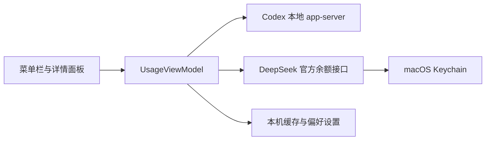

# 架构与数据流

## 应用结构

明明有数 · Minget 是基于 Swift Package Manager 构建的 macOS 菜单栏应用。工程内部继续使用 `UsageMonitor` 标识，主要代码位于 `Sources`，测试位于 `Tests`。

| 模块 | 职责 |
| --- | --- |
| `UsageMonitorApp` | 应用生命周期、状态栏项目、菜单和设置入口 |
| `UsageMonitorCore` | 额度模型、刷新调度、状态管理和错误分类 |
| `Providers` | Codex 与 DeepSeek 的取数实现及历史服务迁移 |
| `Security` | Keychain、敏感字段清理和日志保护 |
| `Views` | 详情面板、连接窗口和设置界面 |

## 数据流

## 服务边界

### Codex

应用连接本机 Codex app-server，读取账户标识和额度窗口。菜单栏遮挡检查只读取本机屏幕和状态项位置，每 10 秒执行一次，不产生网络请求，也不消耗模型 token。

### DeepSeek

应用调用 DeepSeek 官方余额端点。API Key 仅保存在 macOS Keychain，请求不会调用生成模型，因此不会产生模型 token 消耗。

### 历史 GLM 清理

1.1.1 启动服务前清理本应用旧版 GLM 的两个精确 Keychain account 名称、缓存项和非敏感偏好。此路径不读取凭据值、不访问浏览器数据，也不发送网络请求；Keychain 删除失败时保留未完成标记，以便下次启动重试。

## 安全边界

- 不在日志、诊断信息或测试产物中输出 API Key、访问令牌和完整 Cookie。
- DeepSeek API Key 使用 Keychain 保存。
- 调试与归档产物默认位于被 Git 忽略的 `artifacts/`。
- 任何新增服务都应先验证官方取数路径、费用和凭据边界，再进入实现。

---

## English summary

Minget is a Swift Package Manager based macOS menu bar application. The internal package and module names remain `UsageMonitor` for compatibility.

- `UsageMonitorApp` owns the application lifecycle, status item, panel, connection UI, and settings.
- `UsageMonitorCore` owns models, parsing, refresh scheduling, provider clients, caching, and security rules.
- Codex data comes from the local `codex app-server` over stdio JSON-RPC.
- DeepSeek data comes from its official balance endpoint; the API key is stored in macOS Keychain.
- The retired Zhipu GLM integration has no runtime, WebKit, network, or browser-session path in 1.1.1; only its local app-owned retirement cleanup remains.
- Geometry checks for notch and menu bar visibility are fully local and do not consume model tokens.
- Logs and diagnostics exclude API keys, access tokens, full cookies, and raw account responses.
