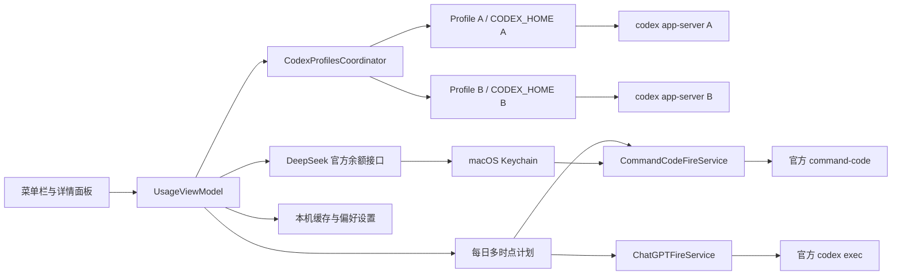

# 架构与数据流

## 应用结构

明明有数 · Minget 是基于 Swift Package Manager 构建的 macOS 菜单栏应用。工程内部继续使用 `UsageMonitor` 标识，主要代码位于 `Sources`，测试位于 `Tests`。

| 模块 | 职责 |
| --- | --- |
| `UsageMonitorApp` | 应用生命周期、状态栏项目、菜单和设置入口 |
| `UsageMonitorCore` | 额度模型、刷新调度、状态管理和错误分类 |
| `Providers` | Codex、DeepSeek 与 Command Code 的取数实现及历史服务迁移 |
| `Security` | Keychain、敏感字段清理和日志保护 |
| `Views` | 详情面板、连接窗口和设置界面 |

## 多 ChatGPT Profile

1.3.0 起 Codex 不再是单一连接，而是两个隔离的账号 Profile。

| 类型 | 职责 |
| --- | --- |
| `ChatGPTAccountProfile` | 只读配置：稳定 ID、显示名、菜单栏短标签、相对 `CODEX_HOME` |
| `CodexProfileRuntime` | 单 Profile 运行态：service、display、connection、account、fetch/fire 状态 |
| `CodexProfilesCoordinator` | 拥有全部运行时，逐 Profile 刷新、并行停止 |
| `UsageService` | 单 Profile 的长生命周期 `codex app-server`、缓存策略与失败预算 |
| `UsageCache` | v3 `profileID + accountID` 命名空间，以及 v2→v3 一次性迁移 |
| `MenuBarPreferences` | 菜单栏来源（Profile ID 或 DeepSeek）与 DeepSeek 币种显示选择 |
| `ChatGPTFireService` | 手动点火：直启官方 Codex CLI，固定参数，丢弃子进程输出 |
| `FireSchedulePreferences` | 三个目标的每日多时点计划、勾选状态和跨重启去重台账 |
| `CommandCodeFireService` | 使用 Keychain Key 和隔离 `HOME` 直启官方 CLI，执行固定最小点火请求 |

配置与运行态分离：Profile 是常量值，运行态全部在 `CodexProfileRuntime` 内由锁保护。业务逻辑以稳定 ID 为键，不依赖数组位置，因此后续版本可以直接扩展第三个 Profile。

## 数据流

## 服务边界

### Codex

每个 Profile 连接一个本机 Codex app-server，读取该账号的标识和额度窗口。子进程环境是当前环境的副本，只覆盖该 Profile 的 `CODEX_HOME`；应用不打开、列出或解析该目录中的任何文件。任何一个 Profile 失败、超时或未登录都不会阻塞另一个。

菜单栏一次只显示一个来源，来源与显示偏好都只保存非敏感选择值。遮挡检查只读取本机屏幕和状态项位置，每 10 秒执行一次，不产生网络请求，也不消耗模型 token。

点火有两条官方 CLI 路径。OpenAI 使用对应 Profile 的官方 Codex CLI；Command Code 使用 Minget Keychain 中的 Key 和隔离临时 `HOME` 启动官方 `command-code` CLI。两者均不经 shell，使用固定最小参数，子进程输出持续 drain 后丢弃，不进日志、缓存或界面。触发来源为用户确认的卡片按钮，或设置页中用户已勾选的每日时间。计划引擎在启动、30 秒 tick、唤醒和时钟改变时评估，只补跑 10 分钟并以计划时刻持久化去重。

1.3.2 起 OpenAI 点火成功后的确认只读额度（`handshake + rateLimits/read`），Command Code 确认只读 `credits`。两者都展示三态、实测差值，并在内存保留最近 3 次。

刷新节奏（1.3.2）：详情页时钟 30 秒一 tick，菜单栏倒计时按需用 `Date()` 计算；ChatGPT 定时按重置时间退避（临近 30 秒、无数据 60 秒、否则 120 秒）；Command Code credits 每轮读取，summary/subscriptions 按凭证摘要隔离并分别复用 15 分钟；菜单栏宽度按尺寸签名缓存；唤醒后只用现有 app-server 探活，失败 Profile 才进入普通刷新，30 秒内与定时轮询互斥。

### DeepSeek

应用调用 DeepSeek 官方余额端点。API Key 仅保存在 macOS Keychain，请求不会调用生成模型，因此不会产生模型 token 消耗。菜单栏选中 DeepSeek 时只显示该接口返回的单一币种金额，不换算、不合计。

### 历史 GLM 清理

1.1.1 启动服务前清理本应用旧版 GLM 的两个精确 Keychain account 名称、缓存项和非敏感偏好。此路径不读取凭据值、不访问浏览器数据，也不发送网络请求；Keychain 删除失败时保留未完成标记，以便下次启动重试。

## 安全边界

- 不在日志、诊断信息或测试产物中输出 API Key、访问令牌、OAuth token、Codex CLI session id、点火 raw output 和完整 Cookie。
- DeepSeek 与 Command Code 的 API Key 使用 Keychain 保存。
- Codex 点火的窄例外是把用户配置的隔离目录作为 `CODEX_HOME` 传给官方 Codex CLI 子进程；应用自身不读取其中的认证文件。
- Command Code 点火是第二个窄例外：Key 只传给隔离 `HOME` 的官方 CLI，应用 HTTP 客户端仍拒绝模型端点。
- 调试与归档产物默认位于被 Git 忽略的 `artifacts/`；渲染测试证据写入 `$TMPDIR/Minget-1.3.0-Evidence/`。
- 任何新增服务都应先验证官方取数路径、费用和凭据边界，再进入实现。

---

## English summary

Minget is a Swift Package Manager based macOS menu bar application. The internal package and module names remain `UsageMonitor` for compatibility.

- `UsageMonitorApp` owns the application lifecycle, status item, panel, connection UI, and settings.
- `UsageMonitorCore` owns models, parsing, refresh scheduling, provider clients, caching, and security rules.
- Since 1.3.0 Codex consists of two isolated profiles: one `CodexProfileRuntime` and one long-lived `codex app-server` child each, coordinated by `CodexProfilesCoordinator`, with a `profileID + accountID`-scoped cache.
- Each child is launched with a copy of the current environment whose `CODEX_HOME` is the profile's isolated directory. Minget never opens, lists or parses that directory.
- The menu bar shows exactly one source at a time — profile A, profile B, or DeepSeek — chosen by a persisted non-secret preference.
- DeepSeek data comes from its official balance endpoint; the API key is stored in macOS Keychain.
- Fire runs the official Codex or Command Code CLI with fixed minimal arguments and discards its output. It is reachable only through a user-confirmed card action or a daily schedule row the user explicitly enabled.
- The retired Zhipu GLM integration has no runtime, WebKit, network, or browser-session path; only its local app-owned retirement cleanup remains.
- Geometry checks for notch and menu bar visibility are fully local and do not consume model tokens.
- Logs and diagnostics exclude API keys, access tokens, session ids, full cookies, and raw account responses.
