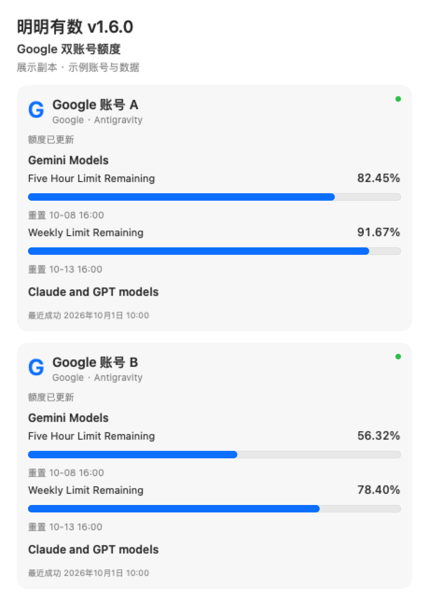
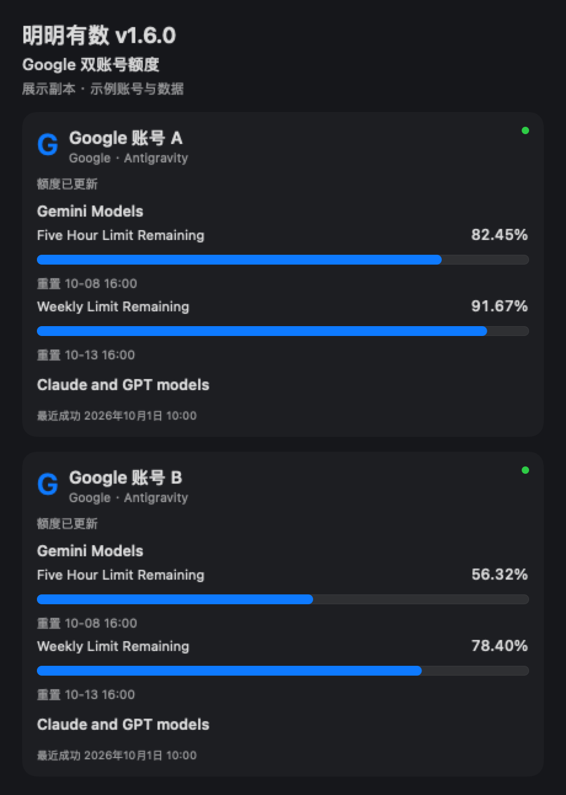
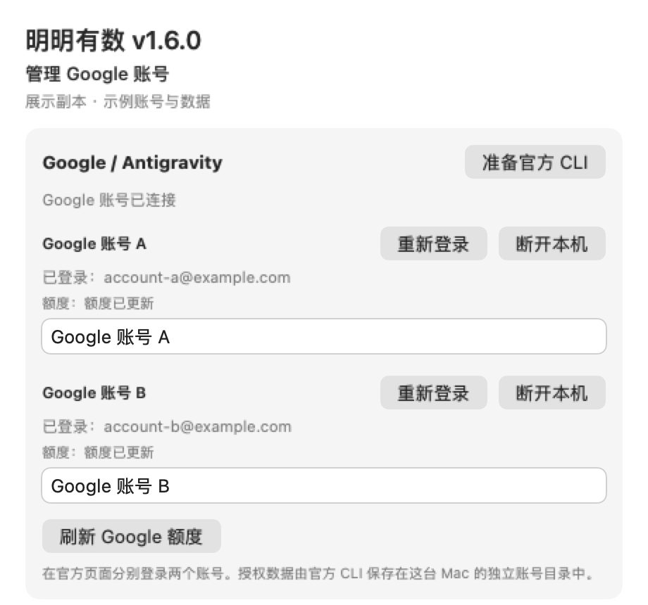
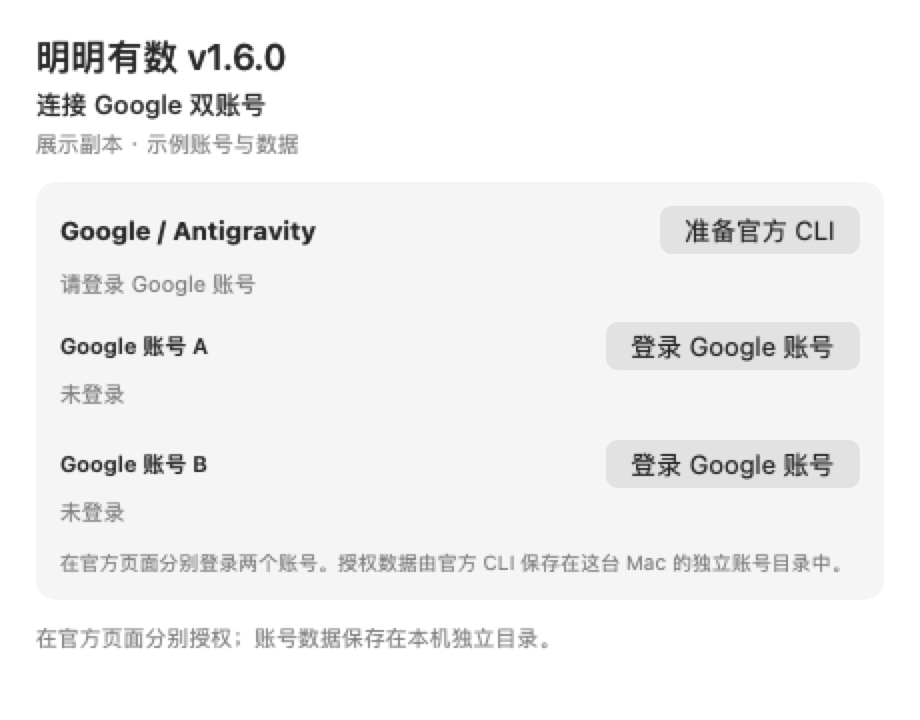

# 明明有数 · Minget 1.6.0

已于 2026-10-01 公开发布：[GitHub Release](https://github.com/ym911x/Minget/releases/tag/v1.6.0)。发布提交远端 CI 通过，详见[发布记录](PUBLICATION.md)。

本版新增 Google / Antigravity 官方 CLI 双账号接入。在应用内分别登录两个 Google 账号，查看官方返回的共享额度组、5 小时及周剩余比例和重置时间。日常查询无需运行 CPA。

## 新增

- Google A/B 独立登录、重新登录、显示名称修改和断开本机；重复邮箱不能覆盖另一槽位。
- 应用内准备 Google 官方 Antigravity CLI 1.2.13，下载固定 Apple Silicon 包并校验 SHA-512 和 Google 签名。
- 通过官方 `/usage` JSON 读取 Gemini、Claude/GPT 共享额度组。卡片百分比保留两位小数，缺失字段显示未知；重置到期重新查询，不推算满额。
- Google 详情卡片、供应商标签与菜单栏账号/额度组选择，五分钟自动刷新、手动刷新和唤醒补刷。
- 每个账号使用独立目录、缓存、刷新任务和失败状态；登录成功与额度读取成功分别显示。

## 修复与迁移

- 修复授权码提交后缺少反馈、授权后首次引导无法继续、Previous/Done 导航误判及套餐后缀影响身份确认的问题。
- 登录取消、超时和失败显示具体状态；失败重试可继续本次待确认目录，重新登录失败保留原连接。
- 后台固定只读额度命令，有界超时并回收自有进程；不使用模型请求验证账号。
- 清理 Minget 自身旧代理连接、管理密钥项和缓存，保留外部 CPA 服务与配置。

## 同时包含此前 1.5.0 的界面更新

1.5.0 没有单独公开发布。本版纳入详情页供应商切换、固定底部操作、共用账号管理窗口、首次连接入口，以及菜单栏浮窗重复点击和收起竞态修复。

## 登录方式

在“管理账号”中点击“准备官方 CLI”，随后分别登录 A/B。浏览器中的 Google 官方授权完成后，将一次性授权码粘贴到 Minget 登录窗口，按实时提示完成官方引导。条款和目录信任由用户确认，可选数据收集可关闭。授权由官方 CLI 在本机专用目录中管理，Minget 不读取或复制认证文件。

## 验证与已知边界

- 本机两个正式 Google 账号的登录、官方 `/usage`、真实卡片逐字段对账、手动刷新及退出重启通过。查询报告为零模型轮次和零 token。
- 应用内官方下载校验、本机 Release 构建和严格签名通过。自动测试结果与本轮发布准备检查见 [验收台账](ACCEPTANCE.md)。
- 第二台 Mac 完整首次安装验收按用户要求延期；自然令牌续期、撤销授权后的恢复及真实睡眠唤醒仍待现场验证。
- Google 接入目前固定 CLI 1.2.13，仅验证 Apple Silicon；官方命令或输出改变时可能需要兼容更新，不承诺其他 CLI 版本。
- 所有公开截图都是正式组件生成的示例展示副本，不包含真实账号或实时额度，不作为真实服务验收证据。

## 源码构建

延续源码分发，公开 Release 不附未经公证的本机签名应用。需要 macOS 13 或以上和 Swift 5.9 或以上；Google 功能需要 Apple Silicon，并从应用内准备固定官方 CLI。Minget 不捆绑 Google 可执行文件。

下载 Source code 后，在项目目录执行：

```sh
MINGET_SIGN_IDENTITY=- ./scripts/build.sh
```

以上使用本地 ad-hoc 签名。若已有 `Minget Local Signing` 证书，可执行 `./scripts/build.sh` 使用固定本机签名身份；固定签名有助于升级后保持已有 Keychain 授权匹配。

## 展示截图








